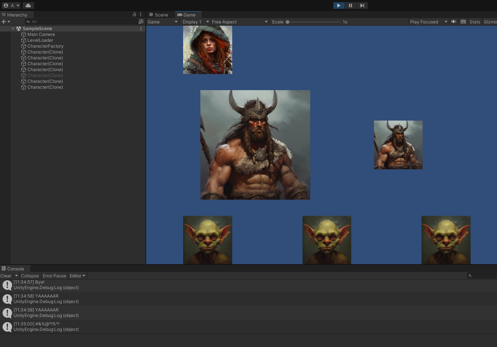
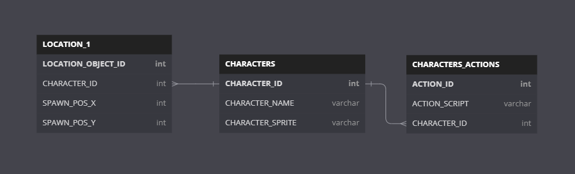
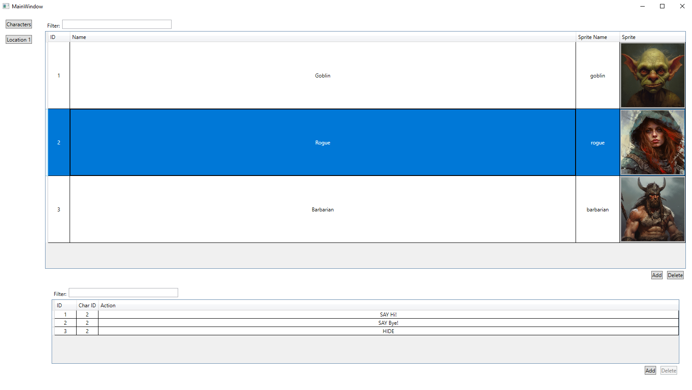

# ExternalGameEditorExample
Unity + SQLite + WPF database editor

<h1>Why?</h1>
The goal of this work is to abandon the writing of editors within the Unity environment.
Using an editor that is not tied to Unity allows for the creation of more complex editors that will be more convenient for the editor user. Additionally, it will attract people to the project who are not familiar with Unity.

<h1>Game</h1>
SampleScene - an example prototype of a location where game entities will be loaded.
After loading, characters described in the database are displayed on the scene. When clicking on each character, actions described in the database are performed for them.

<h2>Actions implemented within this prototype:</h2>
SAY [phrase] - Output the specified [phrase] to the console.
SCALE [scaleFactor] - Scale the character image according to the [scaleFactor].
HIDE - Hide the character from the game field.

<h1>Database</h1>
The database contains descriptions of game characters. For each character, you can specify a name, a link to the art in the game's resources, and actions. Actions are represented as strings that are interpreted in the game's code. The database also contains the Location_1 table - a list of characters and their starting coordinates that need to be created when loading the location.

<h1>Editor</h1>
The editor is a WPF application that allows for convenient editing of an SQLite database. Click on character image to set new one.

